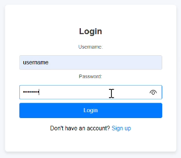
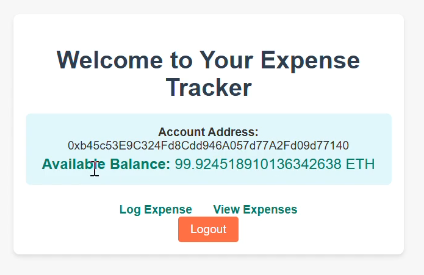
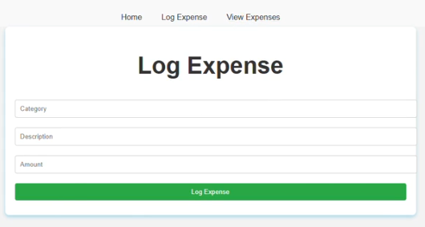

# Expense Tracker Web App Using Blockchain

This repository contains a blockchain-based expense tracker web application. It leverages blockchain technology to log and manage expenses securely and transparently. The project uses Ethereum's blockchain network via Ganache, Metamask for wallet integration, and a Python Flask application for the user interface.

---

## Table of Contents

- [Features](#features)
- [Technologies Used](#technologies-used)
- [Setup and Installation](#setup-and-installation)
- [Application Workflow](#application-workflow)
- [Smart Contract Details](#smart-contract-details)
- [Screenshots](#screenshots)

---

## Features

- **User Authentication:** Login system to access the application.
- **Expense Logging:** Add expenses with category, description, and amount.
- **Blockchain Integration:** Securely stores expense data on the blockchain.
- **Expense Retrieval:** View expenses logged on the blockchain.
- **Account Management:** Displays Ether balance and deducts total expenses.

---

## Technologies Used

### Backend
- **Python (Flask):** For web application development.
- **Web3.py:** To interact with the Ethereum blockchain.
- **Ganache:** Local Ethereum blockchain for development.

### Frontend
- **HTML/CSS:** For the web interface.
- **Bootstrap:** For responsive design.

### Blockchain
- **Solidity:** Smart contract development.
- **Remix IDE:** To write and deploy smart contracts.
- **Metamask:** Ethereum wallet for transactions.

---

## Setup and Installation

### Prerequisites
- Python 3.7 or above
- Ganache (Local Blockchain Network)
- Node.js (for Metamask integration)
- Metamask (Browser Wallet)

### Steps
1. Clone the repository:
   ```bash
   git clone https://github.com/SirineMaaroufi/Expense-Tracker-Blockchain-WebApp.git
   cd blockchain-expense-tracker
   ```

2. Install Python dependencies:
   ```bash
   pip install -r requirements.txt
   ```

3. Start Ganache and note the RPC server URL (e.g., `http://127.0.0.1:7545`).

4. Deploy the smart contract using Remix IDE:
   - Load the `ExpenseTracker.sol` file.
   - Deploy it to your Ganache network.
   - Copy the deployed contract address.

5. Update the contract details in `app.py`:
   - Replace `contract_address` with your deployed contract's address.
   - Replace `ABI.json` with your deployed contract's ABI.
   - Replace the private key with one from your Ganache accounts.

6. Start the Flask application:
   ```bash
   python app.py
   ```

7. Access the app in your browser at `http://127.0.0.1:5000`.

---

## Application Workflow

1. **Login:** Authenticate using a username and password.
2. **Log Expense:** Add an expense with category, description, and amount.
3. **Blockchain Storage:** Expense data is securely stored on the blockchain.
4. **View Expenses:** Retrieve and display logged expenses from the blockchain.
5. **Manage Finances:** View account balance and total expenses.

---

## Smart Contract Details

### Contract: `ExpenseTracker.sol`
- **logExpense:** Logs an expense with category, description, and amount.
- **getExpense:** Retrieves a specific expense by index.
- **getExpenseCount:** Returns the total number of expenses logged.

---

## Screenshots

### 1. Login Page


### 2. Home Page


### 3. Logging Expense


---

## License

This project is licensed under the MIT License - see the [LICENSE](LICENSE) file for details.

